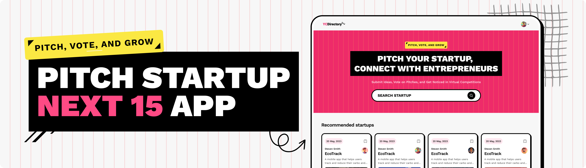

  

 

  

<a  style="cursor: pointer"    href="https://yc-directory-gray-six.vercel.app/" >

🚀 Live Demo
 
</a>

<section id="Introduction"  >
<h1 align="center" > Startup Directory Platform</h1>

 A Next.js 15 platform where entrepreneurs can submit their startup ideas for virtual pitch competitions, browse other pitches, and gain exposure through a clean minimalistic design for a smooth user experience.
 
</section>

<section id="TechStack" >
<h2>⚙️ Tech Stack</h2>

<ul  style="font-size: 1.2rem">

<li>React 19</li>
<li>Next.js 15</li>
<li>Sanity</li>
<li>TailwindCSS</li>
<li>ShadCN</li>
<li>TypeScript</li>
<li>Sentry</li>
<li>Vercel</li>
</ul>
</section>
<section id="Features" style="font-size: 1rem" >
<h2>🔋 Features</h2>
👉 Live Content API: Displays the latest startup ideas dynamically on the homepage using Sanity's Content API.

👉 GitHub Authentication: Allows users to log in easily using their GitHub account.

👉 Pitch Submission: Users can submit startup ideas, including title, description, category, and multimedia links ( image
or video).

👉 View Pitches: Browse through submitted ideas with filtering options by category.

👉 Pitch Details Page: Click on any pitch to view its details, with multimedia and description displayed.

👉 Profile Page: Users can view the list of pitches they've submitted.

👉 Editor Picks: Admins can highlight top startup ideas using the "Editor Picks" feature managed via Sanity Studio.

👉 Views Counter: Tracks the number of views for each pitch instead of an upvote system.

👉 Search: Search functionality to load and view pitches efficiently.

👉 Minimalistic Design: Fresh and simple UI with only the essential pages for ease of use and a clean aesthetic.

and many more, including the latest React 19, Next.js 15 and Sanity features alongside code architecture and reusability
</section>